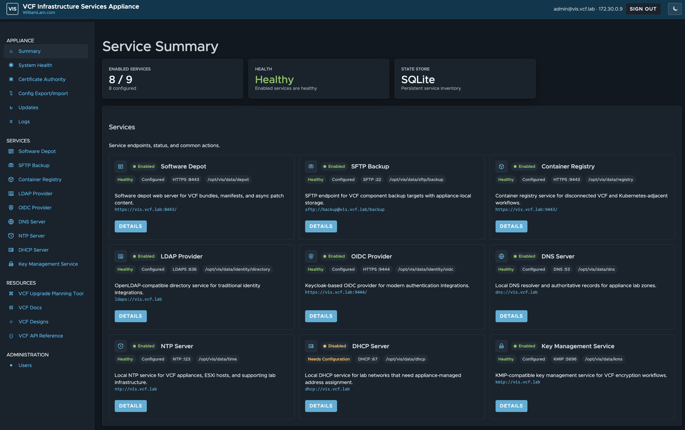

# VCF Infrastructure Services Appliance

The **VCF Infrastructure Services (VIS) Appliance** is an Ubuntu-based virtual appliance that provides key infrastructure services for accelerating VMware Cloud Foundation (VCF) 9.1 lab and proof-of-concept deployments. VIS includes a user-friendly web management interface that allows users to quickly get started without requiring in-depth knowledge of the underlying services.

VIS includes the following capabilities:

- Software Depot for hosting VCF software binaries
- SFTP Backup server for configuring VCF backups
- Container Registry for vSphere Supervisor and vSphere Kubernetes Service (VKS) workflows
- LDAP Provider for traditional VCF Single Sign-On (SSO) integration
- OIDC Provider for modern VCF SSO federation
- DNS Server for lab hostname and reverse lookup records
- NTP Server for VCF appliances, ESX hosts, and supporting lab systems
- DHCP Server for appliance-managed lab network addressing
- Key Management Service for KMIP-compatible encryption workflows
- Shared TLS certificate management for all supported services
- Basic appliance health and storage visibility
- Configuration export/import for repeatable VIS deployments
- Appliance updates from the VIS UI or `vis-update` command
