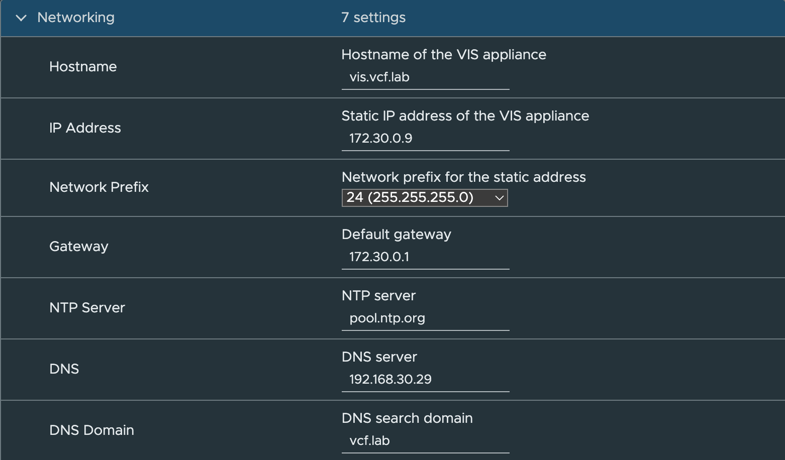
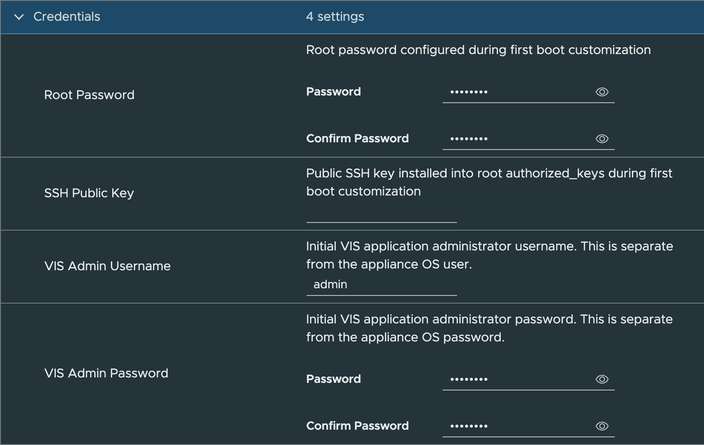
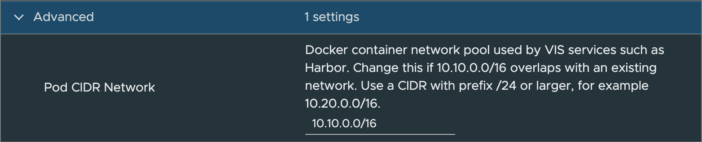
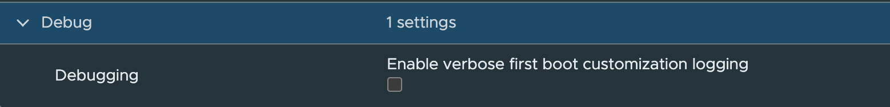

# Deploy

Deploy the VIS OVA to either a vCenter Server or a standalone ESX host. OVF properties are used to set up the initial appliance, including basic networking information, OS credentials, VIS application credentials, an optional SSH public key, and the Docker pod CIDR.

## Table of Contents

- [Resource Requirements](#resource-requirements)
- [Download Split OVA from GitHub](#download-split-ova-from-github)
- [vCenter Server Deployment](#vcenter-server-deployment)
- [Standalone ESX Deployment with OVF Tool](#standalone-esx-deployment-with-ovf-tool)

## Resource Requirements

VIS requires the following minimum virtual hardware:

| Resource | Minimum |
| --- | --- |
| CPU | 2 vCPU |
| Memory | 4 GB |
| Storage | 30 GB minimum |

Storage consumption will increase based on which services are enabled and how they are used. Software Depot, Container Registry, and backup repository usage can grow significantly as VCF bundles, container images, and backup artifacts are added.

## Download Split OVA from GitHub

GitHub release assets have a file size limit, so VIS release OVAs may be published as split parts. Download every part and the checksum manifest before reconstructing the OVA.

Example release assets:

```text
vcf-infrastructure-services-appliance-1.0.3.ova.part-aa
vcf-infrastructure-services-appliance-1.0.3.ova.part-ab
vcf-infrastructure-services-appliance-1.0.3.ova.part-ac
vcf-infrastructure-services-appliance-1.0.3.ova.sha256
vcf-infrastructure-services-appliance-1.0.3.ova.parts.sha256
```

Verify the downloaded parts first:

```shell
shasum -a 256 -c vcf-infrastructure-services-appliance-1.0.3.ova.parts.sha256
```

Reconstruct the OVA:

* Linux/macOS

```shell
cat vcf-infrastructure-services-appliance-1.0.3.ova.part-* > vcf-infrastructure-services-appliance-1.0.3.ova
```

* Windows PowerShell
```shell
cmd /c 'copy /b vcf-infrastructure-services-appliance-1.0.3.ova.part-a* vcf-infrastructure-services-appliance-1.0.3.ova'
```


Verify the reconstructed OVA before importing it:

```shell
shasum -a 256 -c vcf-infrastructure-services-appliance-1.0.3.ova.sha256
```

The final checksum must pass before deploying the OVA. If it fails, delete the reconstructed OVA, re-download the failed part listed by `shasum`, and repeat the verification.

Release maintainers can create the split files and checksums with:

```shell
cd output-vmware-iso
shasum -a 256 vcf-infrastructure-services-appliance-1.0.3.ova > vcf-infrastructure-services-appliance-1.0.3.ova.sha256
split -b 1900m vcf-infrastructure-services-appliance-1.0.3.ova vcf-infrastructure-services-appliance-1.0.3.ova.part-
shasum -a 256 vcf-infrastructure-services-appliance-1.0.3.ova.part-* > vcf-infrastructure-services-appliance-1.0.3.ova.parts.sha256
```

## vCenter Server Deployment









## Standalone ESX Deployment with OVF Tool

For environments without vCenter Server, use the sample OVF Tool script:

Step 1 - Make a local copy of the deployment script

```shell
cp scripts/deploy_vis_esx.sh scripts/deploy_vis_esx.local.sh
```

Step 2 - Edit the variables based on your environment

```shell
OVFTOOL="/Applications/VMware OVF Tool/ovftool"
VIS_OVA="./output-vmware-iso/vcf-infrastructure-services-appliance-1.0.3.ova"

# ESX deployment target
ESX_HOST="172.30.0.10"
ESX_USERNAME="root"
ESX_PASSWORD="VMware1!"
VM_NETWORK="VM Network"
VM_DATASTORE="local-vmfs-datastore-1"
VM_NAME="vis"

# VIS appliance networking
# Separate multiple DNS or NTP servers with commas.
VIS_FQDN="vis.vcf.lab"
VIS_IP="172.30.0.9"
VIS_NETMASK="24 (255.255.255.0)"
VIS_GATEWAY="172.30.0.1"
VIS_DNS_SERVERS="192.168.30.29"
VIS_DNS_DOMAIN="vcf.lab"
VIS_NTP_SERVERS="pool.ntp.org"

# Appliance OS credentials
VIS_ROOT_PASSWORD="VMware1!"

# Optional root SSH public key. Leave empty to skip.
VIS_SSH_PUBLIC_KEY_FILE=""

# VIS web application administrator credentials.
# This is separate from the appliance OS/root credential.
VIS_ADMIN_USERNAME="admin"
VIS_ADMIN_PASSWORD="VMware1!"

# Advanced: Docker container address pool used by VIS services such as Harbor.
# Change this if 10.10.0.0/16 overlaps with your lab network.
VIS_POD_CIDR_NETWORK="10.10.0.0/16"

# Enable verbose first-boot logging. Debug logs may include credentials.
VIS_DEBUG="false"
```

Step 3 - Run the script

```shell
./scripts/deploy_vis_esx.local.sh
```

The script deploys directly to a standalone ESX host and passes the required `guestinfo.*` OVF properties that VIS consumes during first boot customization.

All VIS services are disabled by default. Users will need to configure and enable only the services they require. Please see the [Usage](usage.html) page for some examples.
